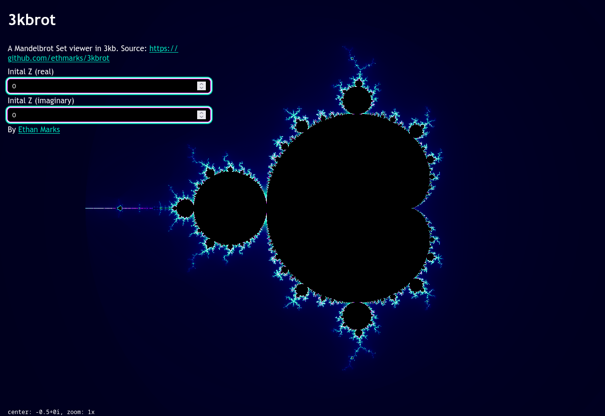
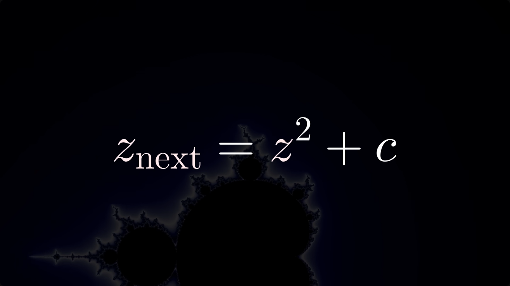
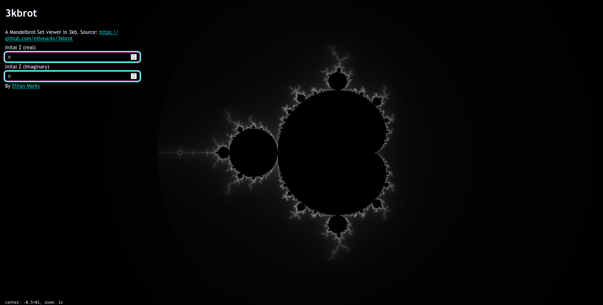
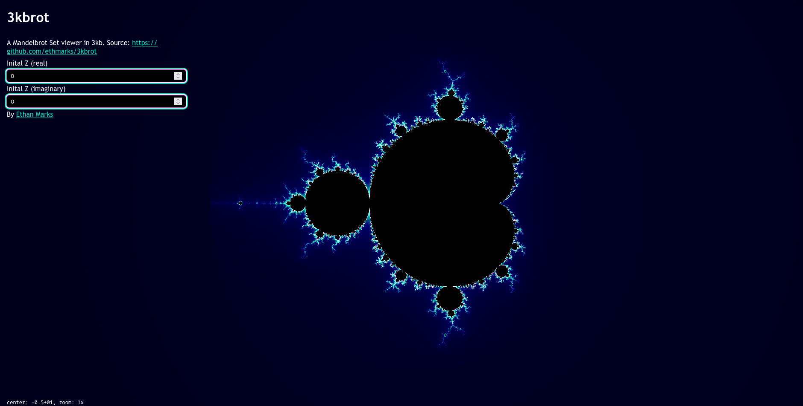
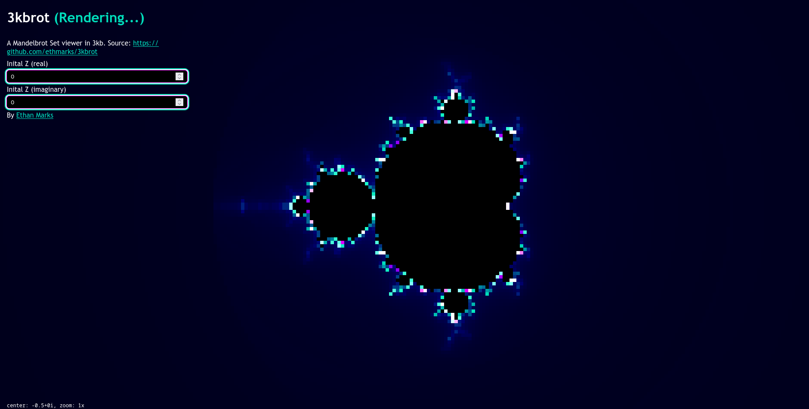
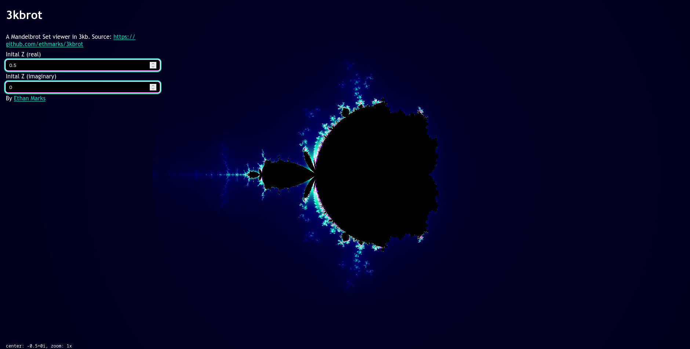

# 3kbrot

Mandelbrot Set viewer in 3kb



## Demo

Copy the code below and paste it into the address bar of a new tab:

```
data:text/html,<body><canvas id="c"></canvas><div id="t"><h1>3kbrot <span id="r">(Rendering...)</span></h1><p> A Mandelbrot Set viewer in 3kb. Source: <a href="https://github.com/ethmarks/3kbrot" >https://github.com/ethmarks/3kbrot</a ></p><label for="izr">Initial Z (real)</label><input id="izr" type="number" step="0.1" /><label for="izi">Initial Z (imaginary)</label><input id="izi" type="number" step="0.1" /><footer> By <a href="https://github.com/ethmarks">Ethan Marks</a></footer></div><div id="s"></div><style>body{margin:0;text-shadow:2px 2px 1px %23000020;touch-action:none}canvas{width:100vw;height:100vh;image-rendering:pixelated}div{color:white;font-family:"Trebuchet MS",sans-serif;margin-left:1rem;position:absolute;display:flex}%23t{top:0;flex-direction:column;max-width:50ch}%23s{bottom:0;font-family:monospace}%23r{color:%2301dfbc}p{margin:0.5rem 0}input{padding:6px 9px;border-radius:6px;margin:6px 0;border:none;color:white;background:black;box-shadow:0 0 0 1px %23ee04ff,0 0 0 3px %23f1ffff,0 0 1px 5px %2301dfbc}input:focus{outline:none}a{color:%2301dfbc}</style><script>const t=c.getContext("2d");let e,n,i,o,d=300,a=1,l=-.5,u=0,h=0,w=0;function g(t,e){return 0===t?0:255*([.1,.5,.5][e]+[1,1,.81][e]*Math.cos(2*Math.PI*([.69,1,.41][e]*t+[.52,.5,.67][e])))}function v(t,e){n[t+0]=g(e,0),n[t+1]=g(e,1),n[t+2]=g(e,2),n[t+3]=255}function p(i){a=i,c.width=innerWidth/a,c.height=innerHeight/a,e=t.getImageData(0,0,c.width,c.height),n=e.data,function(){const n=a/d,i=c.width/2;let o=0,r=-c.height/2*n-u;for(let t=0;t<c.height;t++){let t=-i*n+l;for(let e=0;e<c.width;e++){let e=h,i=w,d=0,c=e*e,a=i*i;for(;c+a<4&&d<100;){const n=2*e*i+r;e=c-a+t,i=n,c=e*e,a=i*i,d++}v(o,100===d?0:.01*(d+1-Math.log2(Math.log2(c+a)))),o+=4,t+=n}r+=n}t.putImageData(e,0,0)}()}function f(){s.textContent=`center: ${l}+${u}i, zoom: ${Math.round(d/300)}x`,clearTimeout(i),p(8),i=setTimeout(()=>{r.style.display="unset",setTimeout(()=>{p(1),r.style.display="none"},0)},400)}window.addEventListener("resize",f),window.addEventListener("wheel",t=>{d*=Math.pow(1.0015,-t.deltaY),f()});let m=0,y=0;function z(){o=!1,document.body.style.cursor="grab"}z(),window.addEventListener("pointerdown",t=>{o=!0,m=t.clientX,y=t.clientY,document.body.style.cursor="grabbing"}),window.addEventListener("pointerup",z),window.addEventListener("pointercancel",z),window.addEventListener("pointermove",t=>{if(o){const e=t.clientX-m,n=t.clientY-y;l-=e/d*1,u+=n/d*1,m=t.clientX,y=t.clientY,f()}}),izr.value=0,izi.value=0,izr.addEventListener("input",()=>{h=izr.value,f()}),izi.addEventListener("input",()=>{w=izi.value,f()}),f();</script></body>
```

You can also visit <https://ethmarks.github.io/3kbrot/>.

## How it Works

### The math

The math to generate the Mandelbrot Set works basically like this:

1. Turn the pixel coordinates into a point on the complex plane, which we'll
   call $c$
2. Set $z$ (another complex number) equal to zero and plug $c$ into this
   equation: $z_{next}=z^2+c$
3. Take the result of the equation and plug it back into the equation as the new
   value of $z$
4. Repeat step 3 an infinite number of times
5. If, after applying the equation an infinite number of times, the output is
   still fairly small, then $c$ is in the Mandelbrot set. If it's approaching
   infinity, then it's not in the Mandelbrot set
6. If it's in the Mandelbrot set, color the pixel black. Otherwise, color it
   depending on how many iterations it took before $z$ started to diverge
   towards infinity
7. Repeat steps 1-6 for every pixel on the screen



_Image from [2swap](https://youtu.be/Ed1gsyxxwM0?t=55)_

Obviously, I can't really apply the equation an _infinite_ number of times, so I
just approximate it. Mathematically, if $|z|$ ever becomes greater than 2, I
know that it'll diverge towards infinity and I can just stop there. For points
that stubbornly refuse to be greater than 2, I can set a max number of
iterations to check before giving up and assuming that it's in the Mandelbrot
set so that I don't have to continue checking forever.

## The colors

Coloring points inside the Mandelbrot set is easy because it's just pure black,
but there are lots of ways to color points outside of it. The math part produces
a value `t` between 0 and 1 representing how long it takes to diverge (with 0
meaning that it instantly diverges, and 1 meaning that it took so long to
diverge that I just gave up and assumed).

I could just turn `t` directly into a color by multiplying it by 255, but that
would be boring:



I settled on using an
[Inigo Quilez palette](https://iquilezles.org/articles/palettes/) which I
generated by spamming the "Randomize" button on
<https://www.stevenfrady.com/tools/palette> until I found an interesting-looking
palette.

[My palette](https://www.stevenfrady.com/tools/palette?p=0.1,0.5,0.5,1,1,0.81,0.69,1,0.41,0.52,0.5,0.67)
starts at a deep blackish blue, then fades to teal, then to white, then to
magenta, and finally to purple:


I took the GSLS snippet that the palette generator spat out, translated it to
JavaScript, and plugged `t` into the formula to get the pixel's color:



### Optimizations

The Mandelbrot set is not cheap to compute. On a HD screen, the inner loop can
run up to **207 million** (!!!) times per frame in the worst case. On my laptop,
it often ran about 18 million times per frame, taking ~600 milliseconds, which
is obviously way too slow.

That ~600ms number wasn't easy to get, either. It was around ~2000ms before. I
had to do lots of
[algorithmic and arithmetic optimizations](https://github.com/ethmarks/3kbrot/commit/45af77aa5997c503913d974c2bce731d360c2327)
to make it that fast. For example, I pre-computed reciprocals so that I can do
multiplication instead of division.

But the real optimization was the pixelated preview. I first saw this technique
on <https://mandel.gart.nz/>. When the user is dragging the viewport or zooming
or whatever, I render at a tiny resolution and then scale up. 1/8 scale was the
sweet spot from my testing. It looks pixelated and terrible, but because it
involves rendering so much fewer pixels, I can render it basically instantly.



I only render the fractal at full resolution after the user has stopped moving
for a bit (400ms). I think it's a good compromise, because it keeps navigation
snappy and responsive, but the user can still see the overall shape so they can
see what they're doing.

### Initial Z

Remember back when I said:

> Set $z$ (another complex number) equal to zero...

You can also chose a different complex number for the initial value of $z$. Here
what it looks like if you set $z$ to $0.5+0i$:



As crazy as it sounds, I don't know of any other Mandelbrot set viewers that let
you do this. I've checked about a dozen so far, and although some of them can
display [Multibrot Sets](https://en.wikipedia.org/wiki/Multibrot_set) and
[Julia Sets](https://en.wikipedia.org/wiki/Julia_set), none of them let you
choose the initial $z$ value.

I don't even know what it's called. The
[Mandelbrot set Wikipedia article](https://en.wikipedia.org/wiki/Mandelbrot_set#Generalizations)
doesn't mention it. I first heard it mentioned in
[2swap's Mandelbrot set video, from 2:44 to 3:15](https://youtu.be/Ed1gsyxxwM0?t=164),
but he doesn't give it a name.

[The Ultra Fractal manual](http://ultrafractal.helpmax.net/en/fractal-formulas/standard-fractal-formulas/mandelbrot/)
mentions it, but it doesn't name it either:

> Starting point
>
> For the standard Mandelbrot set, this should be set to (0, 0). Other values
> create distorted shapes that can be interesting, but they are usually not as
> well-formed as the standard set. Try (0, -0.6), for example.

But anyways, 3kbrot lets you explore how changing the initial Z value affects
the shape of the fractal; whatever it's called.

## License

This project is under an MIT License. See [LICENSE](./LICENSE) for more
information.
